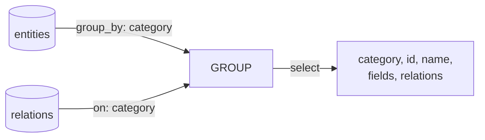

# Queries Specification

クエリ定義の仕様。YAML DSL による正規化済みデータの整形・射影・結合を定義する。

## ファイル構成

`queriesDir`（デフォルト: `docs/definition/queries/`）配下に YAML ファイルとして配置する。

```
{queriesDir}/
  erd.yaml
  screen-details.yaml  # screens を加工した view
```

## データソース

クエリは `normalizedContentsDir` / `normalizedSchemaDir` の正規化済みデータに対して評価される。テンプレートは常に `viewsDir` のみを参照し、normalized データを直接使うことはない。

### 自動パススルー

正規化済みデータは自動的に views にコピーされる（パススルー）。`contentsDir` に配置したデータは、クエリを書かなくてもテンプレートから参照可能。クエリは追加の view（join、集計等）を定義する場合にのみ記述する。

### 同名禁止

クエリ名と正規化済みデータ名（テーブル名）の重複は禁止する（エラー）。クエリの `from:` は常に正規化済みデータ（テーブル）を指すため、同名を許すと循環参照が生じる。加工が必要な場合はクエリに別名を付ける。

```yaml
# queries/entity-details.yaml — entities を加工した別名の view
from: entities
join:
  - from: relations
    on: category
```

## YAML DSL

### 語彙

SQL の基本語彙に対応させた最小限の DSL:

| SQL 相当 | YAML DSL |
|---|---|
| FROM | `from:` |
| SELECT | `select:` |
| WHERE | `where:` |
| GROUP BY | `group_by:` |
| ORDER BY | `sort:` |
| JOIN | `join:` |

### 例

```yaml
# queries/erd.yaml
from: entities
group_by: category
join:
  - from: relations
    on: category
select: [category, id, name, fields, relations]
```

この定義自体を Mermaid で可視化できる（Access の Query Design View 相当）:



### JOIN

`join:` は **LEFT JOIN がデフォルト**。FK 制約を強制しない設計のため、参照先が存在しないケースが起こりうる。INNER JOIN だと該当行が黙って消え、LEFT JOIN なら参照先が NULL になるだけで行は残り、テンプレートの出力で「TBD」等として可視化できる。

```yaml
join:
  - from: relations
    on: category
    type: inner          # 明示的に INNER JOIN が必要な場合
```

FK 制約が整備され `--strict` で警告ゼロになったプロジェクトでは、LEFT JOIN と INNER JOIN の結果は同一になる。LEFT JOIN デフォルトはデータ品質が低い段階で安全側に倒す設計であり、品質が上がれば差はなくなる。

## 出力

views は `viewsDir` に YAML ファイルとして書き出される。自動パススルー分と、クエリ評価結果の両方が含まれる。

```
{viewsDir}/
  entities.yaml       # 自動パススルー（normalized からコピー）
  screens.yaml        # 自動パススルー
  prose.yaml          # 自動パススルー（Markdown データソース）
  erd.yaml            # {queriesDir}/erd.yaml の評価結果
  screen-details.yaml # {queriesDir}/screen-details.yaml の評価結果
```

## 構文の詳細

詳細な構文は実装時に確定する。ER/DFD/CRUD の3つのユースケースに必要十分な語彙から始める。