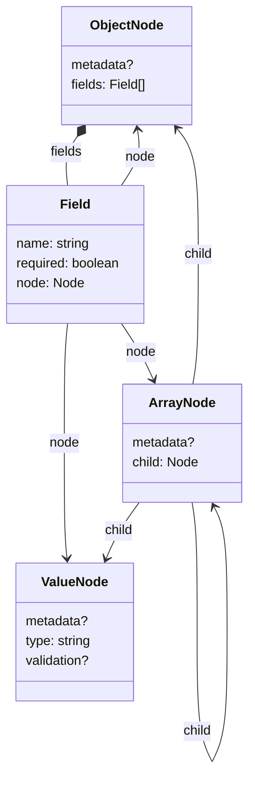

# SchemaInspector

スキーマ定義を解析し、データカタログ（フィールド一覧）を抽出する。
IN: `schemaDir`
OUT: `dataCatalogDir`

## 目的

ユーザ定義スキーマ（JSON Schema サブセット）から、後続コンポーネントやメタドキュメンテーションが扱いやすいフラットな構造情報を抽出する。

JSON Schema のキーワード（`additionalProperties`, `properties`, `items` 等）をそのまま下流に渡すと、クエリやテンプレートが JSON Schema の構造を知る必要があり冗長になる（[normalizer.md](normalizer.md) 背景セクション参照）。SchemaInspector がこの変換を一手に引き受ける。

## 処理フロー

1. `schemaDir` の全 YAML ファイルを読み込み・マージ
2. SchemaSchema でバリデーション（既存の `check_schema`）
3. スキーマからデータカタログを抽出
4. `references` をそのまま転記
5. `dataCatalogDir` に `__definition` キーで出力

## 実装方針: スキーマ木（SchemaTree）

データカタログの抽出を 2 ステップで行う:

1. **スキーマ → SchemaTree**（JSON Schema の構造を吸収）
2. **SchemaTree → データカタログ**（フラットなエンティティ/フィールドを生成）

JSON Schema の構造パターン（`additionalProperties`, `properties`, `items` 等）の解釈を Step 1 に閉じ込め、Step 2 は木構造だけを相手にする。

### SchemaTree のノード定義



- **ObjectNode** — 名前付きの子を複数持つ。`properties` に対応
- **ArrayNode** — 子を 1 つ持つ。`array` および `additionalProperties` に対応
- **ValueNode** — リーフ。`string`, `number`, `integer`, `boolean` 等
- **Field** — 親 ObjectNode と子 Node を結ぶエッジ。`required` は親子間の関係

`metadata`（title, description, ...）は全ノードに付与可能。`validation`（enum, minimum, ...）は ValueNode のみ。

### スキーマ → SchemaTree の変換ルール

| スキーマパターン | ノード |
|---|---|
| `object` + `properties` | ObjectNode（各 property を Field として再帰） |
| `object` + `additionalProperties: {type: object, ...}` | ArrayNode → ObjectNode（暗黙の `id` フィールドを追加） |
| `object` + `additionalProperties: {type: T}` (非 object) | ArrayNode → ObjectNode({id, value: T}) |
| `array` + `items` | ArrayNode（items を子として再帰） |
| スカラー型 | ValueNode |

### 背景: なぜ木構造を経由するか

JSON Schema の構造パターン（`additionalProperties`, `properties`, `items`）とその組み合わせ（ネスト、配列の配列、スカラー辞書等）を直接データカタログに変換しようとすると、パターンごとの分岐が組み合わせ的に増える。木構造を中間表現にすることで:

- Step 1 は「JSON Schema → 3 種のノード」だけに集中でき、パターン追加時も局所的な変更で済む
- Step 2 は JSON Schema を意識せず、木の走査だけでデータカタログを生成できる
- 将来 `dict_to_array`（コンテンツデータの正規化）も同じ木構造を利用して簡素化できる可能性がある

## データカタログの出力形状

→ [データカタログ出力形状](../../../data-catalog/overview.md)（フィールド一覧・クラス図・ERD）

### SchemaTree → データカタログの変換ルール

木構造を走査し、フラットなエンティティ/フィールドに変換する:

- **トップレベルの各スキーマ** → 木を構築し、ルートノードに応じてエンティティを生成
- **ObjectNode** → コンテキストによりエンティティ化またはプレフィックス付きフィールド展開
  - トップレベルまたは ArrayNode の子 → 新しいエンティティとして分離
  - properties 内のネスト → 親エンティティに `prefix.name` でフラット展開
- **ArrayNode → ObjectNode** → `object[]` 型フィールド + 子 ObjectNode をエンティティ化
- **ArrayNode → ValueNode** → `${type}[]` 型フィールド
- **ArrayNode → ArrayNode → ...** → `${type}[][]` 等（ネスト分だけ `[]` を付与）
- **ValueNode** → そのまま型フィールド
- **Field.required** → フィールドの `required` 属性に転記

### references

入力の `references` をそのまま転記する。

## 出力例

example-project のスキーマを入力とした場合:

```yaml
__definition:
  entities:
    - id: entities
      fields:
        - { id: id, type: string, required: true }
        - { id: name, type: string, required: true }
        - { id: category, type: string, required: false }
        - { id: description, type: string, required: false }
        - { id: fields, type: "object[]", required: true }

    - id: entities.fields
      fields:
        - { id: id, type: string, required: true }
        - { id: name, type: string, required: true }
        - { id: type, type: string, required: true }
        - { id: pk, type: boolean, required: false }
        - { id: fk, type: string, required: false }

    - id: relations
      fields:
        - { id: from, type: string, required: true }
        - { id: to, type: string, required: true }
        - { id: cardinality, type: string, required: true }
        - { id: description, type: string, required: false }

  references:
    - from: entities.fields
      to: entities.fields
    - from: relations.from
      to: entities
    - from: relations.to
      to: entities
```

