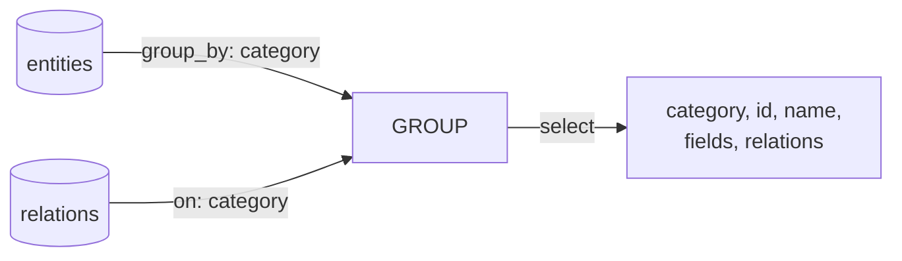

# Queries Specification

クエリ定義の仕様。YAML DSL による正規化済みデータの整形・射影・結合を定義する。

## 基本方針

テンプレートエンジンでも JSONata でもなく、**YAML DSL** を使用する。

YAML DSL を選択した理由:
- **クエリ自体が構造化データ**: このツール自身で管理・検証・可視化できる（dog fooding）
- **AI が MCP 経由で編集可能**: JSONPath + JSON Patch でクエリ定義を操作できる
- **Access の Query Design View に相当する可視化**: クエリ定義を Mermaid 等で図示できる

## ファイル構成

`model/queries/` 配下に YAML ファイルとして配置する。

```
model/queries/
  erd.yaml
  screen.yaml
  users.yaml           # パススルークエリ
```

## データソース

クエリは `output/model/normalized/` の正規化済みデータに対して評価される。テンプレートは常に `output/model/views/` のみを参照し、normalized データを直接使うことはない。

normalized データをそのままテンプレートで使いたい場合は、パススルークエリを定義する:

```yaml
# queries/users.yaml — 変換なしでそのまま views/ に出力
from: users
```

## YAML DSL

### 語彙

SQL の基本語彙に対応させた最小限の DSL:

| SQL 相当 | YAML DSL |
|---|---|
| FROM | `from:` |
| SELECT | `select:` |
| WHERE | `where:` |
| GROUP BY | `group_by:` |
| ORDER BY | `sort:` |
| JOIN | `join:` |

### 例

```yaml
# queries/erd.yaml
from: entities
group_by: category
join:
  - from: relations
    on: category
select: [category, id, name, fields, relations]
```

この定義自体を Mermaid で可視化できる（Access の Query Design View 相当）:



### JOIN

`join:` は **LEFT JOIN がデフォルト**。FK 制約を強制しない設計のため、参照先が存在しないケースが起こりうる。INNER JOIN だと該当行が黙って消え、LEFT JOIN なら参照先が NULL になるだけで行は残り、テンプレートの出力で「TBD」等として可視化できる。

```yaml
join:
  - from: relations
    on: category
    type: inner          # 明示的に INNER JOIN が必要な場合
```

FK 制約が整備され `--strict` で警告ゼロになったプロジェクトでは、LEFT JOIN と INNER JOIN の結果は同一になる。LEFT JOIN デフォルトはデータ品質が低い段階で安全側に倒す設計であり、品質が上がれば差はなくなる。

### テンプレートエンジン版との比較

| 観点 | テンプレートエンジン（旧） | YAML DSL（新） |
|---|---|---|
| データの流れ | データ→テキスト→データ | データ→データ |
| エスケープ | YAML エスケープが必要 | 不要（値はデータのまま流れる） |
| 型の保持 | テキスト経由で劣化の可能性 | 保持される |
| 可視化 | 不可能（テンプレートは不透明） | 可能（YAML = 構造化データ） |
| AI による編集 | テキスト置換 | JSONPath + JSON Patch |

## 出力

各クエリの評価結果は `output/model/views/` に YAML ファイルとして書き出される。ファイル名はクエリファイル名と対応する。

```
output/model/views/
  erd.yaml            # queries/erd.yaml の評価結果
  screen.yaml         # queries/screen.yaml の評価結果
  users.yaml          # パススルークエリの結果（normalized をそのままコピー）
```

## 構文の詳細

詳細な構文は実装時に確定する。ER/DFD/CRUD の3つのユースケースに必要十分な語彙から始める。