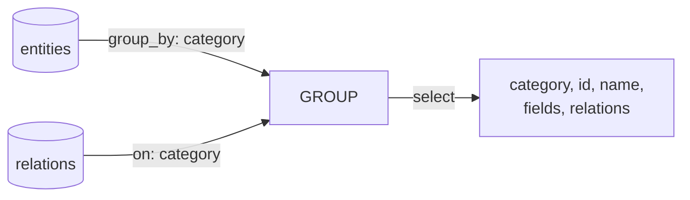

# Query Engine + テンプレート層 再設計

2025-03-08〜10 の設計議論を元にした、toc 層・テンプレート層の再設計。

旧タイトル「Reports 層再設計」から改題。

## 背景

### 旧設計の課題

1. **toc の責務が曖昧**: 「ドキュメント単位の導出」と言いつつ `permalink` や `sectionId` というページルーティングの情報を持つ
2. **テンプレートのフロントマターとの責務重複**: ページ定義が toc と template の両方に分散
3. **11ty への不要な依存**: pagination・フロントマター処理のためだけに 11ty を使用
4. **テンプレートがグローバルなコンテキストに依存**: 各テンプレートが `source` ルートオブジェクトから必要なデータを自力で掘り出している

### テンプレートエンジンによるデータ変換の限界（2025-03-09 の議論で明確化）

旧 reports 層（旧 toc 層）は LiquidJS / Jinja2 テンプレートで source データを整形していた：

```yaml
# 旧: reports/erd.yaml.liquid（テンプレートエンジンでデータ変換）
erd:
  
  
  - key: "{{ cat }}"
    title: "{{ cat }} の ER図"
    entity:
      
      ...
  
```

これは本質的に SQL の SELECT / WHERE / DISTINCT / GROUP BY に相当する操作を、テキスト生成エンジンで行っている。問題点：

1. **データ→テキスト→データのラウンドトリップ**: source（オブジェクト）→ Liquid でテキスト生成 → YAML パース → オブジェクト。不要な変換が2回入る
2. **YAML エスケープ問題**: テキストとして YAML を生成するため、ノルウェー問題（`NO` が boolean 扱い）等のエスケープ問題が発生する
3. **型の劣化**: テキスト経由で整数・浮動小数の区別等が失われる可能性

### MS-Access アナロジー

source / queries / templates の三層構造は MS-Access の Table / Query / Form・Report に対応する：

| MS-Access | このアプリ | 役割 |
|---|---|---|
| Table | source/ | 正規化されたデータ |
| Query (View) | queries/ | データの整形・射影・結合の**定義** |
| Form / Report | templates/ | 表現・レイアウト |

Access の Query は SQL で書く。テンプレートエンジンで Query を書くのは、Excel のセルに SQL を文字列として組み立てるようなもの。Query にはクエリ言語を使うべき。

さらに、Access の Query Design View は SQL を書かずに GUI でクエリを構築できる。queries/ を YAML DSL で定義することで、クエリ自体が構造化データとなり、このツール自身で可視化できる（dog fooding）。

## 新設計

### アーキテクチャ概要

```
model/
  schema/               →  Validator       →  normalized + errors
  source/               →
                            Preparer       →  output/prepared/
  queries/              →
presentation/
  templates/ + paging/  →  Document Generator  →  output/documents/
                            Document Renderer   →  output/rendered/
```

3コンポーネント構成:

- **Validator**: schema/ に基づく検証と正規化
- **Preparer**: normalized データ + queries/ から prepared データを生成
- **Document Generator**: prepared + templates/ から Markdown を生成
- **Document Renderer**: Markdown → HTML（Hugo）

### メタ構造: ツール内蔵の schema / queries / templates

ツールはユーザプロジェクトの schema/ / queries/ / source/ の**全体を source データとして扱う**。
そのために、ツール自身が内蔵の schema / queries / templates を持つ：

| | ツール内蔵（メタレベル） | ユーザプロジェクト |
|---|---|---|
| schema | JSON Schema の検証規則、YAML DSL の構文規則 | schema/ の各ファイル |
| queries | schema / queries / source を可視化するクエリ | queries/ の各ファイル |
| templates | Query Design View、スキーマ一覧 等の可視化テンプレート | templates/ の各ファイル |
| source（対象） | ユーザの schema/ + queries/ + source/ | ドメインデータ |

```
ユーザが書くもの          ツールにとっての役割
──────────────          ────────────────
schema/                  → source（検証対象データ）
queries/                 → source（可視化対象データ）
source/                  → source（検証・変換対象データ）
```

これにより:
- ツールがユーザの schema/ を検証できる（内蔵 schema で）
- ツールがユーザの queries/ を Query Design View として可視化できる（内蔵 queries + templates で）
- ツールがユーザの source/ をドメインビューとして可視化できる（ユーザの queries + templates で）

ユーザの開発ループ:
1. ツールが描画した schema / queries / source の**可視化結果を見る**
2. 「ここをこう変えたい」と AI に伝える
3. AI が直接ファイルを編集する（CUD）
4. ツールが再検証・再描画 → 1 に戻る

product.md の「AIによる認知負荷の吸収」がこの構造で実現される。

また、Phase 3・4 の開発自体がこのツールの dog fooding になる。Phase 2 で Document Generator が動いた時点から、ツール自身を使いながら標準 schema / queries / templates を開発できる。

### Validator の責務

1. **schema/ 自体の検証**: schema/ の YAML が有効な JSON Schema であることを検証
2. **source/ の型検証**: source/ データを schema/ の JSON Schema で検証
3. **参照整合性チェック**: FK 制約相当の整合性検証
4. **正規化**: `additionalProperties` パターン（辞書形式）を配列 + id フィールドに正規化

#### スキーマ形式: JSON Schema をそのまま採用

独自スキーマ形式は設計しない。JSON Schema をそのまま使い、`additionalProperties` の解釈で辞書→配列の正規化を行う：

```yaml
# schema/users.yaml — JSON Schema 形式
type: object
additionalProperties:        # ← これが辞書パターンのシグナル
  type: object
  properties:
    name: { type: string }
    email: { type: string }
  required: [name]
```

正規化ルール：
- `additionalProperties` がオブジェクトスキーマ → 辞書パターン。`properties` に明示されたキーはそのまま残し、それ以外のキーを配列 + id フィールドに変換
- `properties` のみ → 固定構造のオブジェクト、そのまま

```yaml
# source/users.yaml（人間が書く形 — 辞書形式）
version: "1.0"
tanaka:
  name: 田中太郎
  email: tanaka@example.com
suzuki:
  name: 鈴木花子

# normalized（Validator が出力する形 — 配列形式）
version: "1.0"
items:
  - id: tanaka
    name: 田中太郎
    email: tanaka@example.com
  - id: suzuki
    name: 鈴木花子
```

### Preparer の責務

normalized データに対して queries/ の YAML DSL を評価し、prepared データを生成する。

### queries/: YAML DSL によるデータ変換

queries/ は source データを整形・射影し、テンプレートに渡すツリー構造を定義する。
テンプレートエンジンでも JSONata でもなく、**YAML DSL** を使用する。

YAML DSL を選択した理由：
- **クエリ自体が構造化データ**: このツール自身で管理・検証・可視化できる（dog fooding）
- **AI が MCP 経由で編集可能**: JSONPath + JSON Patch でクエリ定義を操作できる
- **Access の Query Design View に相当する可視化**: クエリ定義を Mermaid 等で図示できる

```yaml
# queries/erd.yaml — YAML DSL
from: entities
group_by: category
join:
  - from: relations
    on: category
select: [category, id, name, fields, relations]
```

この定義自体を Mermaid で可視化できる（Access の Query Design View 相当）：



テンプレートエンジン版との比較：

| 観点 | テンプレートエンジン（旧） | YAML DSL（新） |
|---|---|---|
| データの流れ | データ→テキスト→データ | データ→データ |
| エスケープ | YAML エスケープが必要 | 不要（値はデータのまま流れる） |
| 型の保持 | テキスト経由で劣化の可能性 | 保持される |
| 可視化 | 不可能（テンプレートは不透明） | 可能（YAML = 構造化データ） |
| AI による編集 | テキスト置換 | JSONPath + JSON Patch |

#### YAML DSL の語彙（暫定）

SQL の基本語彙に対応させた最小限の DSL：

| SQL 相当 | YAML DSL |
|---|---|
| FROM | `from:` |
| SELECT | `select:` |
| WHERE | `where:` |
| GROUP BY | `group_by:` |
| ORDER BY | `sort:` |
| JOIN | `join:` |

詳細な構文は実装時に確定する。ER/DFD/CRUD の3つのユースケースに必要十分な語彙から始める。

#### key 属性

- `key`: 機械的な識別子。英数字・ハイフン・アンダースコアのみ
- `title`: 人間向けの表示名（日本語OK）
- `key` はクラス内でユニーク
- `key` を持つオブジェクトは自動的にフラットアンカーマップに登録される（リンク可能になる）

#### ID 体系

グローバルにユニークな ID はエンジンが自動生成する：

- class = ラッパーキーのドット区切りパス（例: `erd`, `erd.entity`）
- ID = `{class}.{key}`（例: `erd.user-management`, `erd.entity.user`）
- ラッパーキーは **単数形** で記述する

同じ `key` でも異なるクラスなら共存できる：

| id | class | key | title |
|---|---|---|---|
| `erd.user-management` | erd | user-management | ユーザー管理の ER図 |
| `erd.entity.user` | erd.entity | user | ユーザー |
| `screen.user` | screen | user | ユーザー画面 |

### ユーザプロジェクト構成

```
my-project/
  model/
    schema/              # スキーマ定義（JSON Schema、Validator が検証・正規化に使用）
    source/              # ソースデータ（人間が書く、AI が直接編集）
    queries/             # Query 定義：YAML DSL（Preparer が評価）
  presentation/
    templates/           # ドキュメントテンプレート（Document Generator が読む）
    paging/              # ページ分割戦略（Document Generator が読む）
  output/                # 全て生成物（.gitignore 対象）
    prepared/            # Preparer が生成（queries/ の評価結果 YAML）
    documents/           # Document Generator が生成（Markdown）
    rendered/            # Document Renderer (Hugo) が生成（HTML）
```

### templates/: 表現

#### root テンプレート

ユーザが必ず書くエントリポイント。ドキュメント全体の構成を定義する：

```jinja2
{# templates/root.md.jinja2 #}
# システム要件定義書




```

読者や目的が異なる場合は root テンプレートを分ける（社内向け、顧客向け等）。

#### `` カスタムタグ

`` は描画をパーシャルテンプレートに委譲する。paging 設定に応じて振る舞いが変わる：

- 対象クラスが paging の分割単位 → 別ファイルに出力し、親にはリンクを残す
- 分割単位でない → インライン展開（通常の `` と同等）

```jinja2
{# templates/erd.md.jinja2 #}
# {{ entry.title }}



```

テンプレート作者は paging を意識しない。同じテンプレートが Web 用（分割）でも PDF 用（全部インライン）でもそのまま動く。

`` は anchor の有無に関係なく使える。anchor と section は直交する概念：
- anchor（`key` 属性）: リンク可能かどうか
- section: 描画を委譲するかどうか

#### パーシャルテンプレート

パーシャル単位で出力フォーマットが決まり、拡張子でエスケープモードを判定する：

```
templates/
  root.md.jinja2             → markdown エスケープ
  erd.md.jinja2              → markdown エスケープ
  entity-detail.md.jinja2    → markdown エスケープ
  mermaid-er.mermaid.jinja2  → mermaid エスケープ
```

### paging/: ファイル分割戦略

クラスとファイルパステンプレートのマッピング。プロファイルとして複数定義し、用途に応じて切り替える：

```yaml
# paging/web.yaml
pages:
  - class: erd
    path: "erd/{{ key }}.md"
  - class: erd.entity
    path: "erd/{{ key }}/entities.md"
```

```yaml
# paging/pdf.yaml
pages:
  - class: erd
    path: "all.md"
```

paging 設定に列挙されたクラスが分割単位。列挙されていないクラスの `` はインライン展開される。

paging に列挙できるのは `key` を持つクラスに限られる（ファイル名生成に `key` が必要なため）。

### フラットアンカーマップ

Document Generator が prepared データのツリーを再帰的に走査し、`key` を持つオブジェクトからフラットマップを自動構築する。

構築手順：

1. ツリー走査 → `key` 持ちオブジェクトの ID（`{class}.{key}`）を収集
2. paging 設定を適用 → 各アンカーが属するページの href を確定
   - paging に該当するクラス → そのページの href
   - 該当しないクラス → 親を辿って最も近い「ページになるアンカー」の href + `#id`
3. テンプレートエンジン起動前にマップ構築を完了させる

テンプレートからは `link_md` フィルタ経由でアクセス。Markdown 内からは `toc:id` 記法でアクセス。

### リンク解決

#### テンプレート内（link_md フィルタ）

```jinja2
{{ "erd.entity.user" | link_md }}
```

→ `[ユーザー](../erd/user-management.md#erd.entity.user)` のような相対リンクを生成。

#### Markdown source 内（toc:id 記法）

```markdown
ユーザーの詳細は[ユーザー](toc:erd.entity.user)を参照。
```

エンジンが `toc:erd.entity.user` をフラットマップから解決し、適切な相対パスに置換する。

## CUD 操作

source/ データの作成・更新・削除（CUD）は **AI が直接ファイルを編集** する。ツール側で CRUD API を提供しない。

理由：
- JSON Schema の構造に対する CRUD API（`AppendAdditionalProperty` 等）は設計が膨大になる
- AI は JSON Schema の書き方を既に知っており、YAML ファイルを直接編集できる
- ツールは YAML を**読むだけ**でよいため、ラウンドトリップ保持（ruamel.yaml 等）が不要

MCP サーバーの役割：
- **Validate**: schema/ 検証 + source/ 型検証 + 参照整合性チェック
- **Query**: Preparer の prepared データを返す
- **CUD**: 不要（AI が直接ファイル編集）

## 処理フロー

```
Validator (validate):
1. model/schema/*.yaml 読み込み → JSON Schema として妥当か検証
2. model/source/*.yaml 読み込み
3. source/ を schema/ で型検証
4. 参照整合性チェック（FK 制約）
5. additionalProperties パターンの正規化（辞書→配列 + id）
6. normalized データ + 検証結果を出力

Preparer (prepare):
7. normalized データ読み込み
8. model/queries/*.yaml 読み込み（YAML DSL）
9. YAML DSL を評価（normalized データに対して from/join/where/group_by/select/sort を適用）
10. output/prepared/*.yaml に書き出し

Document Generator (generate):
11. output/prepared/*.yaml 読み込み
12. ツリー走査 → key 持ちオブジェクトからフラットアンカーマップ構築（ID のみ）
13. paging 設定 × フラットマップ → 各アンカーの href を確定
14. root テンプレートから Jinja2 レンダリング開始
   -  が paging を参照し、分割 or インライン判定
   - link_md フィルタがフラットマップを参照しリンク生成
15. Markdown 内の toc:id リンクをフラットマップから解決
16. output/documents/ にファイル書き出し

Document Renderer (render):
17. Hugo が output/documents/ → output/rendered/ に変換
```

## Validator ↔ Preparer ↔ Document Generator インタフェース

3コンポーネントはファイルを介して疎結合に連携する：

```
Validator → normalized データ → Preparer → output/prepared/ → Document Generator
```

```
output/prepared/          # Preparer が書き、Document Generator が読む
  erd.yaml                # queries/erd.yaml の評価結果
  screen.yaml             # queries/screen.yaml の評価結果
  ...
```

ファイル方式を選択した理由：

- **デバッグ容易性**: queries/ の評価結果を YAML ファイルとして目視確認できる
- **疎結合**: 各コンポーネントが別言語・別プロセスでも動く
- **シンプル**: notify + pull 方式でも結局受け側でデシリアライズが必要。ファイルの方が透明性が高い
- **クリーンビルド**: `rm -rf output/` で全生成物を一括削除できる

## 技術選定

### 実装言語: 未定

Python / TypeScript のいずれかを選択する。決定は実装開始時に行う。

Python を選ぶ場合:
- ユーザーの習熟度が高い
- Jinja2 の autoescape がパーシャル単位のエスケープモード切り替えにフィット

TypeScript を選ぶ場合:
- `npx reqs-builder` による配布の手軽さ
- 既存の TypeScript 参照実装の一部（deep merge ロジック、テストフィクスチャ）を流用可能

いずれの言語でも:
- ツールは YAML を**読むだけ**（CUD は AI が直接編集）のため、高度な YAML ライブラリ（ruamel.yaml 等）は不要
- 標準的な YAML パーサー（PyYAML / js-yaml）で十分

### JSON データモデルについての注記

YAML DSL は「JSON データモデル」（object / array / string / number / boolean / null で構成されるツリー構造）に対して操作する。JSON というシリアライズ形式とは無関係。YAML から読み込んだデータに対しても同様に動作する。

なお、「JSON データモデル」という用語に対応する正式な仕様は存在しない（XML には XML Information Set という W3C 勧告があるが、JSON にはそれに相当するものがない）。CBOR の RFC 8949 が "the JSON data model" という表現を使用しており、本ドキュメントでもこれに倣う。

YAML のデータモデルは JSON データモデルのスーパーセット（日付型、整数/浮動小数の区別、アンカー等）だが、このアプリで扱う source データは JSON データモデルの範囲内に収まる。

## TODO

- [ ] YAML DSL の具体的な構文を設計する（ER/DFD/CRUD の3ユースケースに必要十分な語彙から）
- [ ] example-project でフラットアンカーマップの href 解決を具体例で検証する
  - 特に paging 設定にないクラスの親辿りロジック
- [ ] テンプレートエンジンのエスケープ仕様を確認する
  - Markdown / Mermaid のエスケープモード切り替え
  - パーシャル単位でエスケープモードを切り替え（拡張子で判定: `.md.jinja2`, `.mermaid.jinja2`）
- [ ] クエリ可視化のデザインパターンを調査する（Access Query Design View 等）

## 変更履歴

- 2025-03-10: JSONata を YAML DSL に変更。Data Preparer を Validator と Preparer に分離。CUD は AI 直接編集に変更（MCP CRUD API 廃止）。ruamel.yaml 不要に。実装言語を未定に変更。schema/ を JSON Schema として採用し additionalProperties で辞書→配列の正規化を行う設計を追加
- 2025-03-09: テンプレートエンジンによるデータ変換を JSONata Query Engine に変更。Query Engine を Data Preparer に配置。ディレクトリ構成を model/ + presentation/ + output/ の三層に再編。Python + ruamel.yaml の採用理由を追記。コンポーネント名を Validator → Data Preparer、Generator → Document Generator、Renderer → Document Renderer に変更
- 2025-03-08: 初版。toc 層を reports 層に再設計（テンプレートエンジンによるデータ変換）
